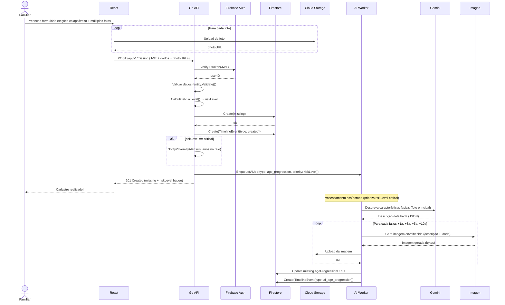
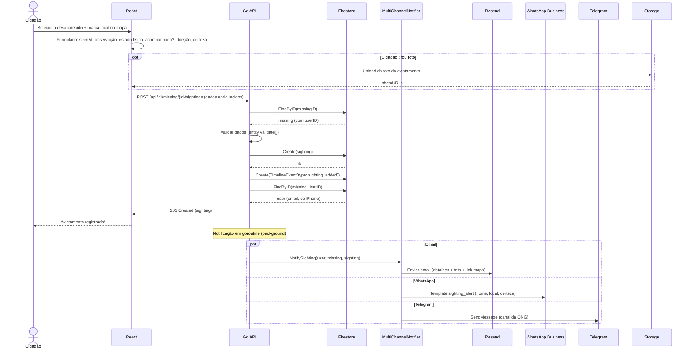
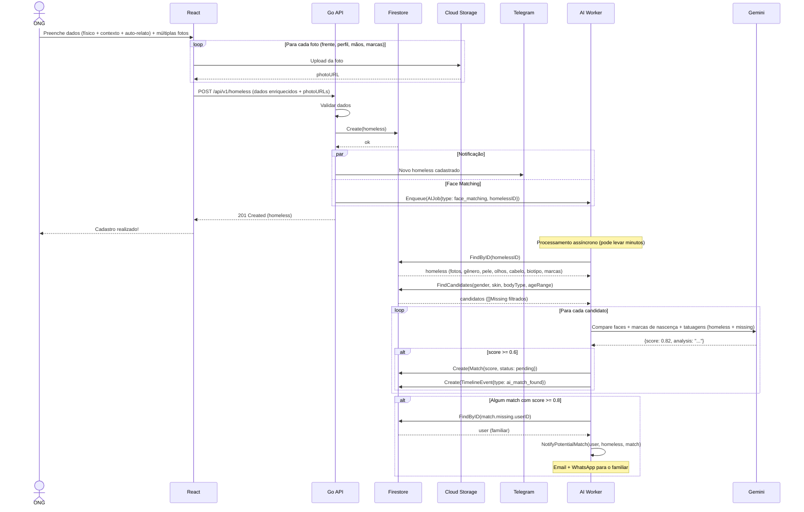
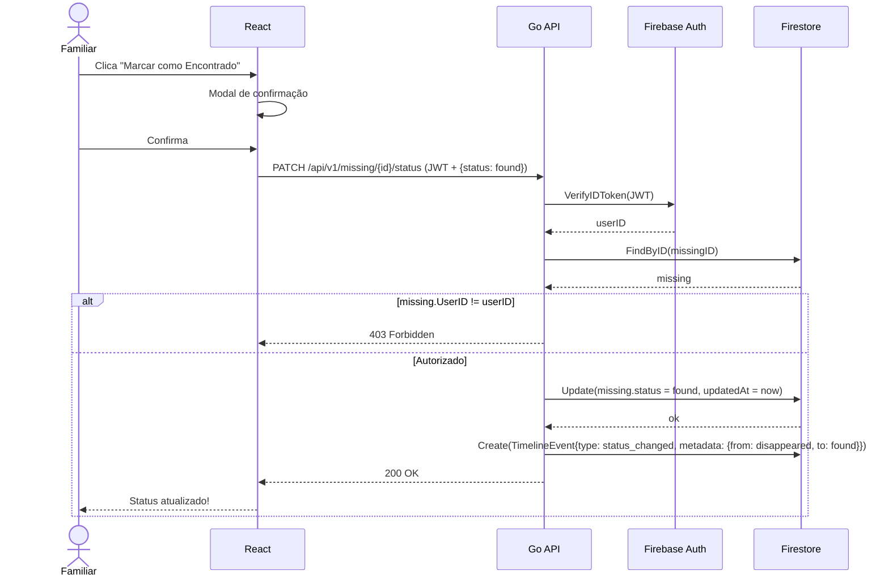
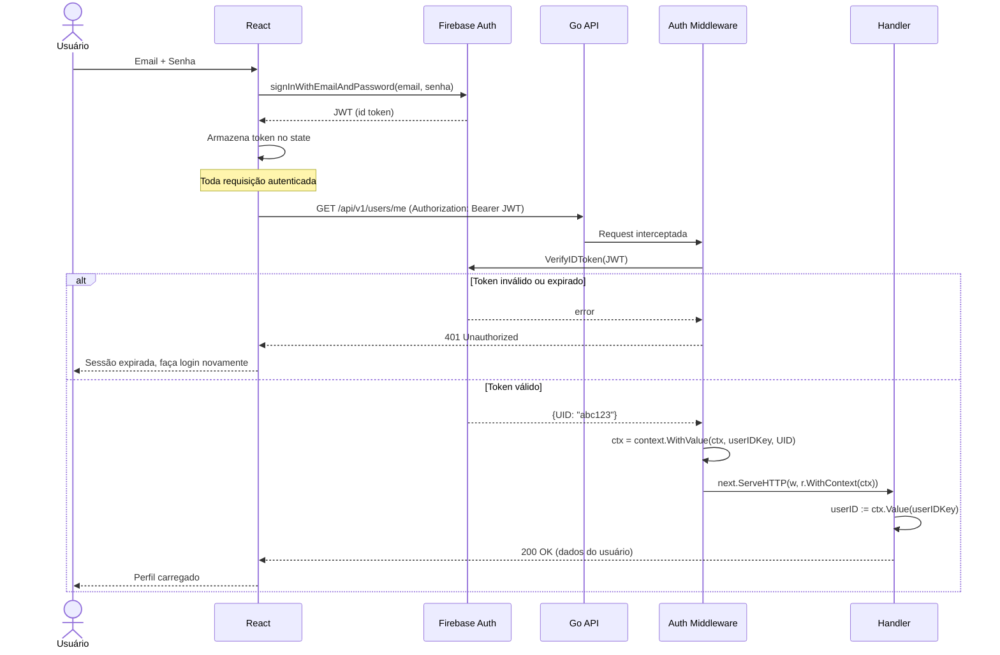
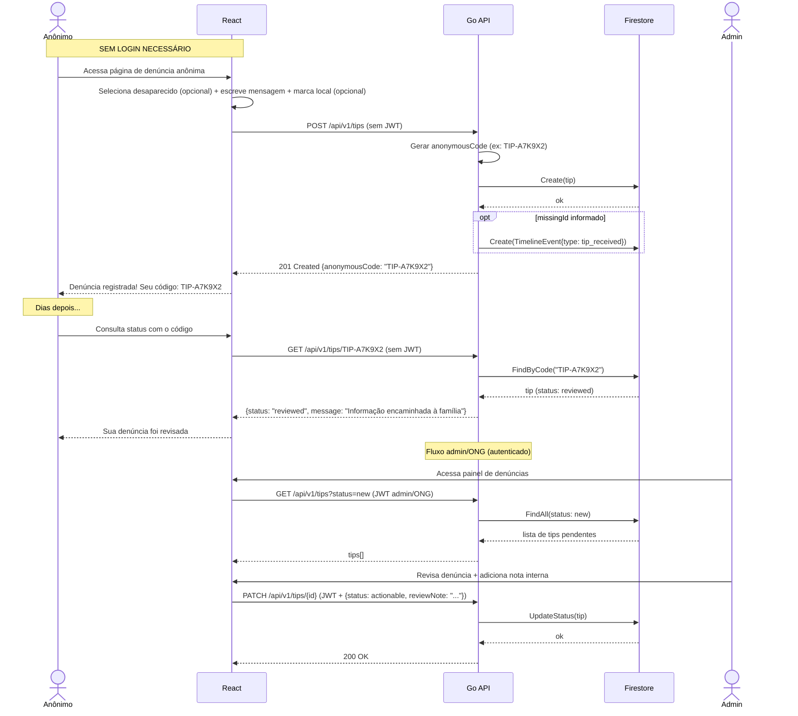
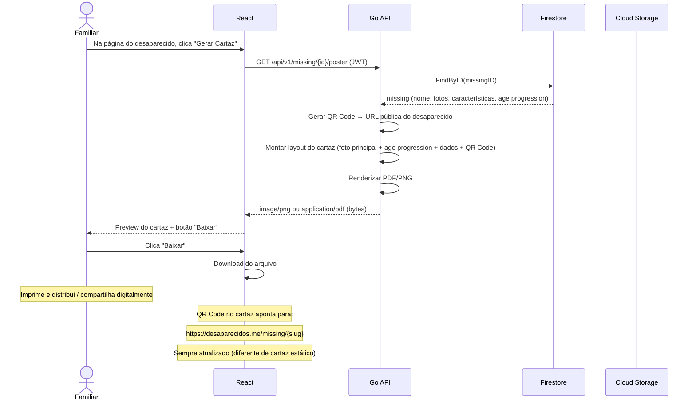
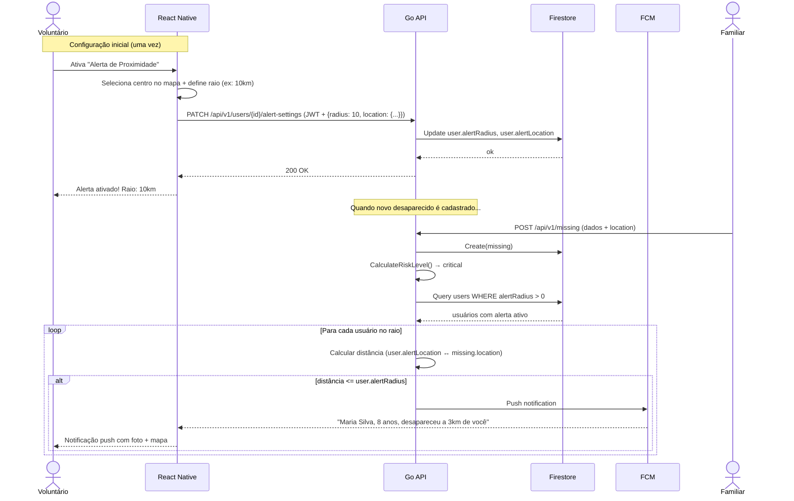

# Diagramas — Desaparecidos.me

> Diagramas em [Mermaid](https://mermaid.js.org/). Renderizam automaticamente no GitHub, GitLab e VS Code (extensão "Markdown Preview Mermaid Support").

---

## 1. Diagrama de Classes (Modelo de Entidades)

```mermaid
classDiagram
    direction LR

    class User {
        +string ID
        +string Name
        +string Email
        +string Phone
        +string CellPhone
        +string AvatarURL
        +bool AcceptedTerms
        +Role Role
        +float64 AlertRadius
        +GeoPoint AlertLocation
        +time CreatedAt
        +time UpdatedAt
        +Validate() error
    }

    class Missing {
        +string ID
        +string UserID
        +string Name
        +string Nickname
        +time BirthDate
        +string Slug
        +Status Status
        ── Físico ──
        +Gender Gender
        +EyeColor Eyes
        +HairColor Hair
        +SkinColor Skin
        +string Height
        +string Weight
        +BodyType BodyType
        +string BirthmarkDescription
        +string TattooDescription
        +string ScarDescription
        +string Prosthetics
        ── Saúde ──
        +MedicalCondition MedicalCondition
        +string MedicalConditionDetails
        +string ContinuousMedication
        +BloodType BloodType
        ── Circunstância ──
        +time DateOfDisappearance
        +GeoPoint DisappearanceLocation
        +GeoPoint LastSeenLocation
        +string LastSeenClothes
        +string UsualClothes
        +Circumstance Circumstance
        +string CircumstanceDetails
        ── Investigação ──
        +string PoliceReportNumber
        +string PoliceStation
        +string InvestigatorContact
        +RiskLevel RiskLevel
        ── Mídia ──
        +array~string~ PhotoURLs
        +map~string,string~ AgeProgressionURLs
        ── Meta ──
        +bool WasChild
        +time CreatedAt
        +time UpdatedAt
        +Validate() error
        +Age() int
        +CalculateWasChild()
        +CalculateRiskLevel() RiskLevel
    }

    class Sighting {
        +string ID
        +string MissingID
        +string UserID
        ── Quando e onde ──
        +time SeenAt
        +GeoPoint Location
        +Direction MovementDirection
        ── Observação ──
        +string Observation
        +PhysicalState PhysicalState
        +Accompanied Accompanied
        +string CompanionDescription
        +ConfidenceLevel ConfidenceLevel
        ── Mídia ──
        +array~string~ PhotoURLs
        +time CreatedAt
        +Validate() error
    }

    class Homeless {
        +string ID
        +string Name
        +string Nickname
        +int EstimatedAge
        +time BirthDate
        +string Slug
        ── Físico ──
        +Gender Gender
        +EyeColor Eyes
        +HairColor Hair
        +SkinColor Skin
        +string Height
        +string Weight
        +BodyType BodyType
        +string BirthmarkDescription
        +string TattooDescription
        +string ScarDescription
        +string Prosthetics
        ── Contexto ──
        +GeoPoint Location
        +SpokenLanguage SpokenLanguage
        +MentalState MentalState
        +string SelfReportedInfo
        +TimeOnStreet EstimatedTimeOnStreet
        +PhysicalCondition PhysicalCondition
        ── Mídia ──
        +array~string~ PhotoURLs
        +time CreatedAt
        +time UpdatedAt
        +Validate() error
        +Age() int
    }

    class Match {
        +string ID
        +string HomelessID
        +string MissingID
        +float64 Score
        +MatchStatus Status
        +string ReviewedBy
        +string GeminiAnalysis
        +time CreatedAt
        +time ReviewedAt
    }

    class Tip {
        +string ID
        +string MissingID
        +string Message
        +GeoPoint Location
        +string AnonymousCode
        +TipStatus Status
        +string ReviewedBy
        +string ReviewNote
        +time CreatedAt
    }

    class TimelineEvent {
        +string ID
        +string MissingID
        +EventType Type
        +string Description
        +string UserID
        +map Metadata
        +time CreatedAt
    }

    class Status {
        <<enumeration>>
        Disappeared
        Found
    }

    class RiskLevel {
        <<enumeration>>
        Critical
        High
        Medium
        Low
    }

    class MatchStatus {
        <<enumeration>>
        Pending
        Confirmed
        Rejected
    }

    class TipStatus {
        <<enumeration>>
        New
        Reviewed
        Actionable
        Dismissed
    }

    class Circumstance {
        <<enumeration>>
        LeftHome
        RanAway
        Abduction
        Hospital
        Disaster
        Unknown
    }

    class MedicalCondition {
        <<enumeration>>
        Alzheimer
        Autism
        Epilepsy
        IntellectualDisability
        None
        Other
    }

    class ConfidenceLevel {
        <<enumeration>>
        Certain
        Likely
        Uncertain
    }

    class Role {
        <<enumeration>>
        User
        Volunteer
        ONG
        Admin
    }

    class Gender {
        <<value object>>
        +string Value
        +IsValid() bool
        +Label() string
    }

    class EyeColor {
        <<value object>>
        +string Value
        +IsValid() bool
        +Label() string
    }

    class HairColor {
        <<value object>>
        +string Value
        +IsValid() bool
        +Label() string
    }

    class SkinColor {
        <<value object>>
        +string Value
        +IsValid() bool
        +Label() string
    }

    class BodyType {
        <<value object>>
        +string Value
        +IsValid() bool
        +Label() string
    }

    class GeoPoint {
        <<value object>>
        +float64 Lat
        +float64 Lng
        +IsValid() bool
    }

    User "1" --> "*" Missing : registra
    Missing "1" --> "*" Sighting : recebe avistamentos
    Missing "1" --> "*" Tip : recebe denúncias
    Missing "1" --> "*" TimelineEvent : histórico
    Homeless "1" --> "*" Match : candidato
    Missing "1" --> "*" Match : referência
    User "1" --> "*" Match : revisa (reviewedBy)

    Missing --> Status
    Missing --> RiskLevel
    Missing --> Circumstance
    Missing --> MedicalCondition
    Missing --> Gender
    Missing --> EyeColor
    Missing --> HairColor
    Missing --> SkinColor
    Missing --> BodyType
    Missing --> GeoPoint

    Homeless --> Gender
    Homeless --> EyeColor
    Homeless --> HairColor
    Homeless --> SkinColor
    Homeless --> BodyType
    Homeless --> GeoPoint

    Sighting --> GeoPoint
    Sighting --> ConfidenceLevel

    Tip --> TipStatus
    Match --> MatchStatus
    User --> Role
```



### Observações sobre o modelo

- **Value Objects** (Gender, EyeColor, BodyType, etc.) não são coleções no Firestore — são tipos Go com validação embutida.
- **GeoPoint** é mapeado para `*latlng.LatLng` do Firestore, permitindo queries geográficas.
- **Missing** agora tem dois GeoPoints: `DisappearanceLocation` (onde sumiu) e `LastSeenLocation` (onde foi visto pela última vez).
- **RiskLevel** é calculado automaticamente pelo service com base em idade, condição médica, circunstância e tempo decorrido.
- **Tip** é a denúncia anônima — sem `userId`, identificada por `AnonymousCode` gerado pelo sistema.
- **TimelineEvent** é alimentada automaticamente em cada ação (create, update, sighting, match, tip, status change).
- **PhotoURLs** (array) substitui `PhotoURL` (string) — múltiplas fotos por entidade.
- **Sighting** agora rastreia estado físico, acompanhantes, direção de movimento e grau de certeza do observador.

---

## 2. Diagrama de Classes (Services e Interfaces)

```mermaid
classDiagram
    direction TB

    class UserRepository {
        <<interface>>
        +Create(ctx, user) error
        +FindByID(ctx, id) User, error
        +FindByEmail(ctx, email) User, error
        +Update(ctx, user) error
        +Delete(ctx, id) error
    }

    class MissingRepository {
        <<interface>>
        +Create(ctx, missing) error
        +FindByID(ctx, id) Missing, error
        +FindByUserID(ctx, userID) ~Missing~, error
        +FindAll(ctx, cursor, limit) ~Missing~, string, error
        +FindCandidates(ctx, filter) ~Missing~, error
        +Update(ctx, missing) error
        +Delete(ctx, id) error
        +Count(ctx) int, error
        +Search(ctx, query) ~Missing~, error
    }

    class SightingRepository {
        <<interface>>
        +Create(ctx, sighting) error
        +FindByMissingID(ctx, missingID) ~Sighting~, error
    }

    class HomelessRepository {
        <<interface>>
        +Create(ctx, homeless) error
        +FindByID(ctx, id) Homeless, error
        +FindAll(ctx) ~Homeless~, error
        +Count(ctx) int, error
    }

    class MatchRepository {
        <<interface>>
        +Create(ctx, match) error
        +FindByID(ctx, id) Match, error
        +FindByHomelessID(ctx, id) ~Match~, error
        +FindByMissingID(ctx, id) ~Match~, error
        +UpdateStatus(ctx, id, status, reviewedBy) error
    }

    class TipRepository {
        <<interface>>
        +Create(ctx, tip) error
        +FindByCode(ctx, code) Tip, error
        +FindAll(ctx, status) ~Tip~, error
        +FindByMissingID(ctx, id) ~Tip~, error
        +UpdateStatus(ctx, id, status, reviewedBy, note) error
    }

    class TimelineRepository {
        <<interface>>
        +Create(ctx, event) error
        +FindByMissingID(ctx, id) ~TimelineEvent~, error
    }

    class Notifier {
        <<interface>>
        +NotifySighting(ctx, params) error
        +NotifyNewHomeless(ctx, params) error
        +NotifyPotentialMatch(ctx, params) error
        +NotifyProximityAlert(ctx, params) error
    }

    class UserService {
        -repo UserRepository
        -authClient AuthClient
        +Create(ctx, input) User, error
        +FindByID(ctx, id) User, error
        +Update(ctx, id, input) User, error
        +Delete(ctx, id) error
        +ChangePassword(ctx, id, newPass) error
        +UpdateAlertSettings(ctx, id, radius, location) error
    }

    class MissingService {
        -repo MissingRepository
        -timelineRepo TimelineRepository
        -aiWorker AIWorker
        +Create(ctx, input) Missing, error
        +FindByID(ctx, id) Missing, error
        +Update(ctx, id, input) Missing, error
        +Delete(ctx, id) error
        +UpdateStatus(ctx, id, status) error
        +Search(ctx, query) ~Missing~, error
        +GetStats(ctx) Stats, error
        +GetTimeline(ctx, id) ~TimelineEvent~, error
        +GeneratePoster(ctx, id) []byte, error
    }

    class SightingService {
        -repo SightingRepository
        -missingRepo MissingRepository
        -timelineRepo TimelineRepository
        -notifier Notifier
        +Create(ctx, input) Sighting, error
        +FindByMissingID(ctx, id) ~Sighting~, error
    }

    class HomelessService {
        -repo HomelessRepository
        -notifier Notifier
        -aiWorker AIWorker
        +Create(ctx, input) Homeless, error
        +FindByID(ctx, id) Homeless, error
        +FindAll(ctx) ~Homeless~, error
    }

    class TipService {
        -repo TipRepository
        -timelineRepo TimelineRepository
        -notifier Notifier
        +Create(ctx, input) Tip, error
        +FindByCode(ctx, code) Tip, error
        +FindAll(ctx, status) ~Tip~, error
        +Review(ctx, id, status, reviewedBy, note) error
    }

    class MatchingService {
        -missingRepo MissingRepository
        -homelessRepo HomelessRepository
        -matchRepo MatchRepository
        -timelineRepo TimelineRepository
        -gemini GeminiClient
        -notifier Notifier
        +ProcessFaceMatching(ctx, homelessID) error
        +ProcessAgeProgression(ctx, missingID) error
    }

    class MultiChannelNotifier {
        -email ResendSender
        -whatsapp WhatsAppSender
        -telegram TelegramSender
        -push FCMPushSender
    }

    UserService --> UserRepository
    MissingService --> MissingRepository
    MissingService --> TimelineRepository
    SightingService --> SightingRepository
    SightingService --> TimelineRepository
    SightingService --> Notifier
    HomelessService --> HomelessRepository
    HomelessService --> Notifier
    TipService --> TipRepository
    TipService --> TimelineRepository
    TipService --> Notifier
    MatchingService --> MissingRepository
    MatchingService --> HomelessRepository
    MatchingService --> MatchRepository
    MatchingService --> TimelineRepository
    MatchingService --> Notifier

    MultiChannelNotifier ..|> Notifier : implementa
```



### Observações sobre a arquitetura

- **Interfaces** vivem no pacote do domínio (ex: `internal/missing/repository.go`). Implementações vivem na infraestrutura (`internal/infrastructure/firestore/`).
- **Services** recebem interfaces no construtor (DI manual). Isso permite trocar Firestore por in-memory nos testes.
- **MultiChannelNotifier** implementa `Notifier` e despacha para Resend, WhatsApp, Telegram e FCM. Cada canal é independente.
- **TimelineRepository** é injetado em múltiplos services — cada ação relevante gera um evento automaticamente.
- **TipService** gerencia denúncias anônimas — sem auth no Create, com auth (admin/ONG) no Review.
- **MissingService.GeneratePoster()** gera o cartaz digital (PDF/imagem) com QR Code.

---

## 3. Diagrama de Sequência — Cadastro de Desaparecido (com Age Progression)



---

## 4. Diagrama de Sequência — Registro de Avistamento (com Notificação)



---

## 5. Diagrama de Sequência — Cadastro de Homeless (com Face Matching)



---

## 6. Diagrama de Sequência — Atualizar Status do Desaparecido (found/disappeared)



---

## 7. Diagrama de Sequência — Login e Proteção de Rotas



---

## 8. Diagrama de Componentes — Visão Geral da Arquitetura

```mermaid
graph TB
    subgraph Cliente
        Web[React Web<br/>Vite + TS + Tailwind]
        Mobile[React Native<br/>Expo - Fase 9]
    end

    subgraph Google Cloud
        subgraph Cloud Run
            API[Go API<br/>Chi Router]
            Worker[AI Worker<br/>Goroutines + Channels]
        end

        Auth[Firebase Auth]
        DB[(Firestore)]
        Storage[Cloud Storage]
        Hosting[Firebase Hosting<br/>CDN]
    end

    subgraph APIs Externas
        Gemini[Gemini API<br/>Vision + Text]
        Imagen[Imagen 3<br/>Geração de Imagem]
        Maps[Google Maps<br/>Platform]
        ResendAPI[Resend<br/>Email]
        WABA[WhatsApp<br/>Business API]
        TG[Telegram<br/>Bot API]
    end

    Web -->|REST + JWT| API
    Mobile -->|REST + JWT| API
    Web -->|Static Files| Hosting
    Web -->|Maps SDK| Maps

    API -->|Verify Token| Auth
    API -->|CRUD| DB
    API -->|Upload/Download| Storage
    API -->|Enqueue Jobs| Worker

    Worker -->|Face Compare| Gemini
    Worker -->|Age Progression| Imagen
    Worker -->|Save Results| DB
    Worker -->|Upload Images| Storage

    API -->|Email| ResendAPI
    API -->|Template Messages| WABA
    API -->|Bot Messages| TG
    API -->|Push (Fase 9)| FCM[FCM]
```

---

## 9. Diagrama de Sequência — Denúncia Anônima (Tips)



---

## 10. Diagrama de Sequência — Cartaz Digital + QR Code



---

## 11. Diagrama de Sequência — Radar de Proximidade (Mobile - Fase 9)


